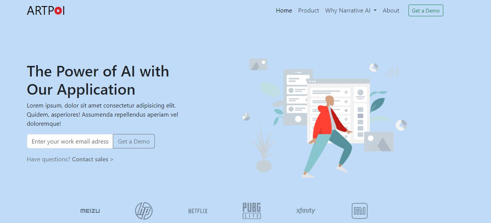
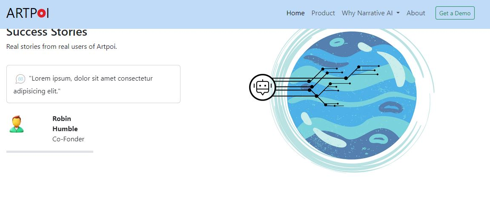
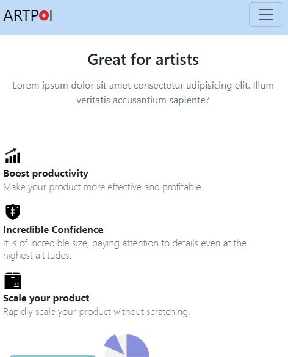
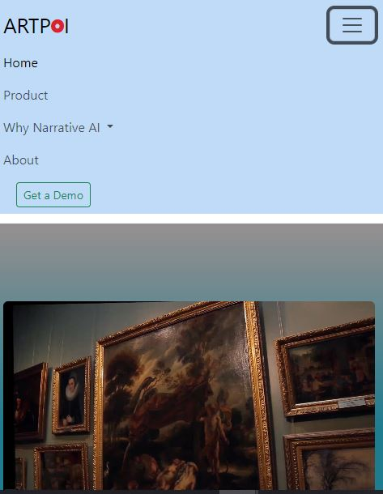

# Paint website solution - Bootstrap 5.3

I improve my coding skills by building realistic projects. 

## Table of contents

- [Overview](#overview)
  - [The challenge](#the-challenge)
  - [Screenshot](#screenshot)
  - [Links](#links)
- [My process](#my-process)
  - [Built with](#built-with)
  - [What I learned](#what-i-learned)
  - [Continued development](#continued-development)
  - [Useful resources](#useful-resources)
- [Author](#author)
- [Acknowledgments](#acknowledgments)


## Overview

### The challenge

Users should be able to:

- View the optimal layout for each of the website's pages depending on their device's screen size
- See hover states for all interactive elements on the page
- View each page and be able to toggle between the tabs to see new information

### Screenshot







### Links

- Solution URL: [Add solution URL here](https://vercel.com/ozgurcc1s-projects/paint-ai)


## My process

I have noticed Bootstrap 5.3 when I didn't use it for a long time. I got used to making pure HTML, CSS, and JS. I have a project with Bootstrap to do it. Besides it's a nice idea for business with AI. I had forgotten it was reliable and comfortable.

it is most important to follow step-by-step while making a project. Because The Bootstrap menu cannot work or is never on time, I had to return.

### Built with

- Bootstrap 5.3
- CSS custom properties
- Flexbox
- CSS Grid
- Javascript


### What I learned

I have worked with Canva and a variety of AI apps. I understand ultimately once again that "No code" is the best for static projects. However, I learned to customize, the layout, utilities, and components of Bootstrap 5.3. 

```html Bootstrap 5.3
<header>
  <nav class="navbar fixed-top navbar-expand-lg bg-nav-body">
    <div class="container">
      <a class="navbar-brand fs-2" href="#">ARTP<span class="text-o">O</span>I</a>
      <button class="navbar-toggler" type="button" data-bs-toggle="collapse" data-bs-target="#navbarSupportedContent" aria-controls="navbarSupportedContent" aria-expanded="false" aria-label="Toggle navigation">
        <span class="navbar-toggler-icon"></span>
      </button>
      <div class="collapse navbar-collapse" id="navbarSupportedContent">
        <ul class="navbar-nav ms-auto mb-2 mb-lg-0">
          <li class="nav-item">
            <a class="nav-link active" aria-current="page" href="#">Home</a>
          </li>
          <li class="nav-item">
            <a class="nav-link" href="#">Product</a>
          </li>
          <li class="nav-item dropdown">
            <a class="nav-link dropdown-toggle" href="#" role="button" data-bs-toggle="dropdown" aria-expanded="false">
              Why Narrative AI
            </a>
            <ul class="dropdown-menu">
              <li><a class="dropdown-item" href="#">Action</a></li>
              <li><a class="dropdown-item" href="#">Another action</a></li>
              <li><hr class="dropdown-divider"></li>
              <li><a class="dropdown-item" href="#">Something else here</a></li>
            </ul>
          </li>
          <li class="nav-item">
            <a class="nav-link" href="#">About</a>
          </li>
        </ul>
        <form class="d-flex" role="search">
          <button class="btn btn-outline-success btn-sm mx-3" type="submit">Get a Demo</button>
        </form>
        
        
      </div>
    </div>
  </nav>
 </header>
```


### Continued development

I want to try "geolocation js", javascript, UI, and grid system in the future on the level phase.

### Useful resources

- [Example resource 1](https://www.canva.com/tr_tr//) - This helped me with the canva.com website on outline reason. 


## Author

- Website - [Özgür Çelik](https://ozgurcelik.hashnode.dev/)
- Github - [@ozgurcelix](https://github.com/ozgurcelix)


